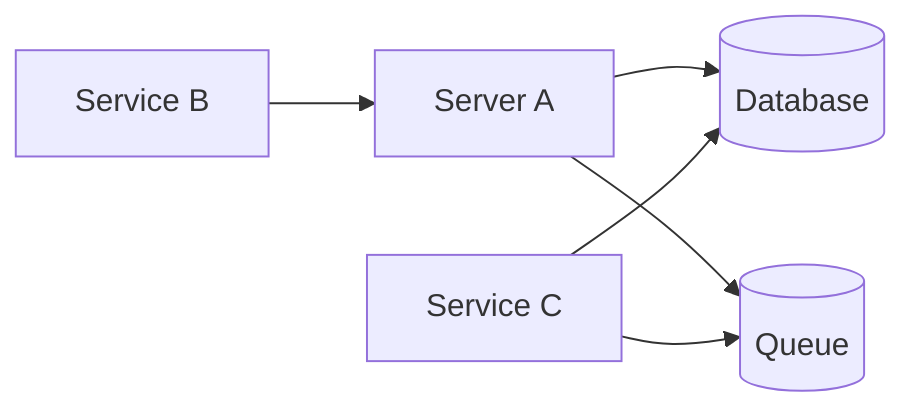

# High-Level Architecture Demo

## Overview

This project is a high-level demonstration of a scalable service-oriented architecture. The implementation intentionally uses lightweight, in-process abstractions to showcase architectural concepts while keeping the code simple and easy to understand.

Run both task.rira and task.rira.client and go to https://localhost:7248/scalar to test it.

This demo may or may not work in container environment, please run it in windows and with Kestrel.

## Architecture

### Demo Components

| Component | Responsibility                                               |
| --------- | ------------------------------------------------------------ |
| Server A  | Receives requests, handles business logic, and offloads work |
| Service B | Simple test client                                           |
| Service C | Queue consumer (merged into Server A for simplicity)         |
| Queue     | In-memory queue implementation                               |
| Cache     | In-memory cache implementation                               |
| Database  | SQLite                                                       |

### Production Equivalents

| Demo                | Production                         |
| ------------------- | ---------------------------------- |
| In-memory Queue     | Kafka, RabbitMQ, Azure Service Bus |
| In-memory Cache     | Redis                              |
| SQLite              | PostgreSQL, SQL Server             |
| In-process Consumer | Dedicated Worker Service           |

### Shared SDK

The SDK project contains shared contracts, DTOs, and service definitions. It can be distributed as a NuGet package and reused across internal services as well as third-party consumers.

## Request Flow

The queue-based path is currently demonstrated for insert operations to showcase asynchronous processing as an alternative to direct database writes.

## Scalability & Resiliency

Separating Service C into an independent service can improve:

* Horizontal scaling
* Throughput
* Fault isolation
* Operational resiliency

The client side can utilize a circuit breaker. A production-ready implementation would ideally persist failed requests and process them through a background retry worker.

## Consumer Enhancements

Potential production features include:

* Retry policies
* Dead Letter Queue (DLQ)
* Distributed locking
* Idempotent message processing

## Areas Not Covered by This Demo

### Testing

* Integration tests
* Load and stress testing

### Failure Scenarios

* Ability for Server A to pause processing on demand
* Graceful degradation and recovery flows

### Observability

* Request tracing
* Queue visibility
* Processing dashboards
* Health monitoring

### Benchmarking

* Throughput measurements
* Latency metrics
* Scalability benchmarks

## Notes

This project is intended as a conceptual demonstration rather than a production-ready implementation.

The only use of AI in this project was formatting and improving this documentation and completing Test Controller. The architecture, implementation, and design decisions were created manually.

<!-- main doc
this app is a highlevel demo of what could be used to fulfil the goal.
the abstractions used are very minimal inprocess just to demonstrate the concept in work.

main idea is:
`
Server A: Handles incoming messages, offload some works, handles scalability by acting as an api front service

Service B: a simple client for test

Service C (merged with Service A, critical in production): Consume Queue 

Queue (Merged in Service A): Kafka or similar services

Cache (Merged in Service A): Redis or similar

Db (Sqlite): Responsive db in production like postgres

SDK project can be packed(nuget) and shared across projects and even thirdparty callers as it contains general models and files
`

seprating Service C can help loadbalancing, resiliency and high throughput

the circut breaker have an applience in client side, better to make it persisted with retry background worker

only used queue logic for insert two show options

its a greate enhancement if we implement dead letter queue, retry policy, distributed locking and idempotency checks

-- what lacks in this demo:
test: especially integration and load
failuire scenario: Service A should be able to pause on demand 
visualization: a quick way to see what is happening inside
benchmark: it's always nice to have

the only usage of AI in this project was to format this document and Test Controller, nothing else
-->